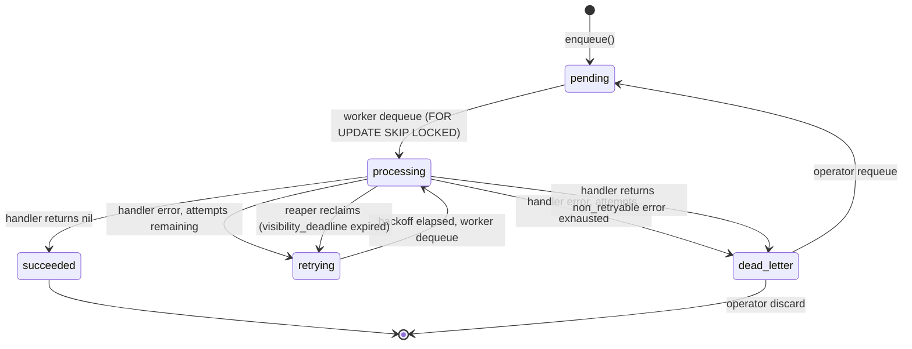
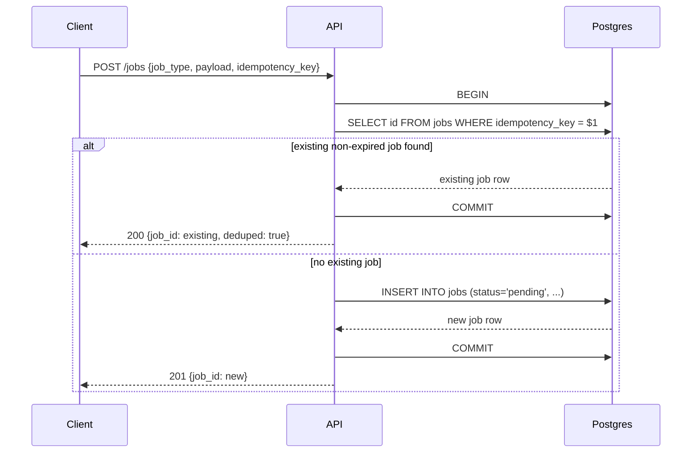

# Flow — Job Lifecycle & System Behavior

## 1. Job State Machine



### States
| Status | Meaning |
|---|---|
| `pending` | Ready to run (new job, or `run_at` reached) |
| `processing` | Currently locked by a worker; `visibility_deadline` set |
| `retrying` | Failed, waiting for backoff delay before next attempt |
| `succeeded` | Terminal — completed successfully |
| `dead_letter` | Terminal — exhausted retries or non-retryable error |

## 2. Enqueue Flow



## 3. Dequeue & Execution Flow

```mermaid
sequenceDiagram
    participant Worker
    participant Postgres
    participant Handler

    loop poll loop
        Worker->>Postgres: BEGIN
        Worker->>Postgres: SELECT ... WHERE status IN (pending,retrying)
                                AND run_at <= now()
                                ORDER BY priority DESC, run_at ASC
                                LIMIT batch_size
                                FOR UPDATE SKIP LOCKED
        Postgres-->>Worker: locked job rows
        Worker->>Postgres: UPDATE jobs SET status='processing',
                                locked_by=$worker_id,
                                visibility_deadline=now()+timeout
        Worker->>Postgres: COMMIT
        Worker->>Handler: Execute(ctx, job.payload)
        alt success
            Handler-->>Worker: nil
            Worker->>Postgres: UPDATE status='succeeded', completed_at=now()
            Worker->>Postgres: INSERT job_attempts (result='success')
        else retryable error
            Handler-->>Worker: error
            Worker->>Postgres: INSERT job_attempts (result='error', message)
            alt attempts < max_attempts
                Worker->>Postgres: UPDATE status='retrying',
                                        run_at = now() + backoff(attempt)
            else attempts exhausted
                Worker->>Postgres: UPDATE status='dead_letter'
            end
        else non_retryable error
            Handler-->>Worker: NonRetryableError
            Worker->>Postgres: UPDATE status='dead_letter'
            Worker->>Postgres: INSERT job_attempts (result='non_retryable')
        end
    end
```

## 4. Backoff Calculation

```
delay = min(base_delay * 2^attempt_number, max_delay)
jittered_delay = random_between(0, delay)   // "full jitter"
run_at = now() + jittered_delay
```

Defaults: `base_delay = 2s`, `max_delay = 15m`, `max_attempts = 5`.
Per-job-type overrides are read from the handler registration config, not
hardcoded, so a "send email" job and a "call flaky third-party API" job can
have very different retry curves.

## 5. Reaper (Crash Recovery) Flow

```mermaid
sequenceDiagram
    participant Reaper
    participant Postgres

    loop every reaper_interval (default 15s)
        Reaper->>Postgres: SELECT pg_try_advisory_lock(reaper_lock_id)
        alt lock acquired
            Reaper->>Postgres: SELECT id, attempt_count FROM jobs
                                    WHERE status='processing'
                                    AND visibility_deadline < now()
                                    FOR UPDATE SKIP LOCKED
            Postgres-->>Reaper: expired job rows
            loop each expired job
                Reaper->>Postgres: INSERT job_attempts (result='reclaimed_by_reaper')
                alt attempts remaining
                    Reaper->>Postgres: UPDATE status='retrying', run_at=now()
                else attempts exhausted
                    Reaper->>Postgres: UPDATE status='dead_letter'
                end
            end
            Reaper->>Postgres: pg_advisory_unlock(reaper_lock_id)
        else lock held elsewhere
            Reaper->>Reaper: skip this tick (another instance is reaping)
        end
    end
```

This is what makes a `SIGKILL`ed worker safe: the job it was holding never
gets stuck in `processing` forever — the reaper notices the missed
heartbeat/deadline and puts it back into the queue, consuming one retry
attempt in the process (so a poison job that always crashes its worker
still eventually reaches `dead_letter` instead of looping forever).

## 6. Long-Running Job Heartbeat

```mermaid
sequenceDiagram
    participant Handler
    participant Worker
    participant Postgres

    Worker->>Handler: Execute(ctx, payload)
    loop every heartbeat_interval, in a goroutine
        Handler->>Worker: heartbeat()
        Worker->>Postgres: UPDATE visibility_deadline = now() + timeout
                                WHERE id=$job_id AND locked_by=$worker_id
    end
    Handler-->>Worker: result
```

Heartbeat writes are conditioned on `locked_by = $worker_id` so a job that
was *already reclaimed* by the reaper (because a heartbeat was missed for
too long) cannot have its deadline extended by a "zombie" worker that
thinks it still owns the job — this is the guard against duplicate
concurrent execution after a reclaim.

## 7. Dead-Letter Recovery Flow

```mermaid
sequenceDiagram
    participant Operator
    participant Dashboard
    participant API
    participant Postgres

    Operator->>Dashboard: View dead-letter list
    Dashboard->>API: GET /jobs?status=dead_letter
    API->>Postgres: SELECT ... WHERE status='dead_letter'
    Postgres-->>API: rows
    API-->>Dashboard: job list + attempt counts
    Operator->>Dashboard: Inspect job, optionally edit payload
    Operator->>Dashboard: Click "Requeue"
    Dashboard->>API: POST /jobs/{id}/requeue {payload?}
    API->>Postgres: UPDATE status='pending', attempt_count=0,
                        run_at=now(), payload=$edited_payload
    API->>Postgres: INSERT audit log entry
    API-->>Dashboard: 200 {status: pending}
```

## 8. Idempotency at the Handler Level

Because delivery is at-least-once, a job may run its handler more than
once (e.g., worker crashes after the side effect but before the DB commit
marking it `succeeded`). Handlers that perform non-idempotent side effects
(charging a card, sending an email) are expected to use the provided
`processed_idempotency_keys` helper:

```
BEGIN
  INSERT INTO processed_idempotency_keys (key) VALUES ($1)
    ON CONFLICT DO NOTHING RETURNING key
  -- if no row returned, this exact side effect already happened; skip it
  -- if a row returned, perform the side effect now, in the same transaction
COMMIT
```

This pattern is documented in the README as the required contract for
handlers with external side effects, rather than something the framework
can silently guarantee for arbitrary code.
